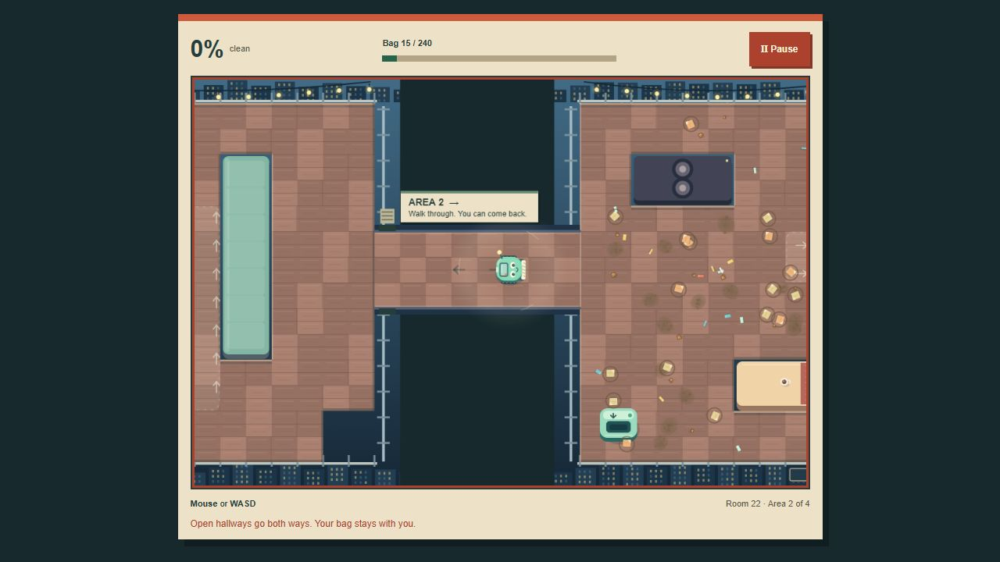

# Little Vac

**Clean rooms. Upgrade your vacuum.**

Little Vac is a browser game about a small vacuum robot cleaning messy rooms. Clear **24 jobs and 50 areas** across a workshop, an after-hours arcade, a greenhouse, and a rooftop party. Earn coins, improve the vacuum, find optional treasures, and unlock seeded Endless rooms.



Later jobs connect several areas through walkable hallways. Clean an area to 100% to open its gate, then travel both ways with your dirt, coins, and room progress intact. A compact HUD keeps the floor visible; yellow markers reveal the last few pieces of dirt.

Built with **JavaScript, Canvas, and Web Audio**, without external runtime libraries or downloaded art and sound assets. The game includes keyboard, mouse, and touch controls, local saves, and automated campaign and progression checks.

Current build: **1.6.7**. Upgrades has four simple rows showing an icon, benefit, and price; exact stats and robot colors open only when needed. A paused shop has one Resume action and one coin counter. Syntax, 45 app checks, desktop/320px layout checks, package integrity, and the hosted display check passed. The itch.io page remains Draft. Purchases use saved coins; pending job earnings stay unavailable until the whole job is complete.

Source: [NathanWNorris/little-vac](https://github.com/NathanWNorris/little-vac). The store is [Little Vac on itch.io](https://fooded.itch.io/little-vac), currently a draft with the verified 1.6.7 build uploaded.

## Play

- Every new job starts **parked in the drop-off dock**. **Left-click inside the room**, or press **WASD / an arrow key** to start and steer. Mouse hovering, held-key repeats from a previous room, and unrelated keys cannot start it. The focused Start button also supports Enter / Space.
- The full picture guide appears only until you complete your first room. Afterward, new jobs and replays show a compact start prompt. **How to play** always opens the full guide.
- After starting, move with **WASD or the arrow keys**, or **move your mouse over the room** and the robot follows it. No holding is needed; leaving the play area stops mouse steering.
- On a touchscreen, **tap the Start button**, then **drag to steer** with the movement joystick or room. Swiping the instructions scrolls them without starting the job.
- Suction is automatic. Each area has **one drop-off dock**. Park beside it to empty the bag automatically.
- A full bag stops suction, but the robot can still move normally. Follow the green arrow to the drop-off dock. Bag contents and their coin value carry through internal doorways; clearing an area does not empty the bag. **Pause → Job details & coins** shows the value still in your bag and the whole job's pending earnings.
- Optional keepsakes go to their own collection shelf, even when the dirt bag is full.
- Clean **100%** of an area. Every piece must be collected; none are swept away automatically. Golden rings help locate the remaining dirt; the final five pieces get larger, brighter rings and pointers. Reduced motion keeps these markers still. In later rooms, follow the amber arrow through the unlocked hallway on the right. Open hallways allow return trips. Mouse, keyboard, and touch control continue without another Start screen.
- A job’s coins remain pending until **every area** is complete. Quitting or restarting discards all its unfinished areas and coins. The optional treasure is in the final area.
- Later dust and stuck leaves need steady suction. Stronger suction clears them faster; no upgrade is mandatory. Medal targets include the whole job.
- Press **Escape** or use **Pause** for a break. Sound and reduced motion are available in Settings.
- Choose **Pause → How to play** to reopen the controls and rules in any room.

There are no lives or mandatory time limits. Bronze rewards finishing; optional silver and gold medals reward faster routes. The timer and target times are in **Pause → Job details & coins**.

## Progression

Four upgrade categories each have five purchasable ranks: cleaning width, bag capacity, movement speed, and pull strength. Every location completed unlocks another cosmetic shell, for five shells in total. Each campaign room also contains one optional trinket for the collection shelf.

Use **Rooms** to see your next room, browse location previews, or replay a completed room. Use **Upgrades** to compare your current robot with the next rank, see what you can afford, and change its color. Open Upgrades from Pause or the menus and spend **saved career coins** while the current job stays paused. Resume the same job with the new stats; its cleaning, bag contents, and progress are kept. Pending coins from the unfinished job cannot be spent and enter your balance only after every area is complete. Quitting is optional and still discards the unfinished job’s cleaning and coins.

Completing a room unlocks the next one regardless of medal, trinket, or upgrade choices. Replays pay their cleaning coins again; completion bonuses, medal improvements, and trinket bonuses are awarded only when newly earned.

Coins, completed rooms, medals, best times, upgrades, shells, trinkets, and settings save in this browser. A job's coins enter your career balance only after every area is complete. Browsing in-game menus pauses the active job; discarding it, closing the page, or reloading loses its unfinished cleaning and coins, including material already emptied at a station. Clearing browser data also clears the career. If browser storage fails, a visible warning explains that the current career remains only in memory for that tab's session.

## Run locally

The game itself has no external runtime dependencies. A recent Node.js installation is needed only for the local server and verification scripts; no package installation is required.

```sh
node scripts/serve.mjs
```

Open `http://127.0.0.1:4180/`. The server binds to the local computer. Serve the files over HTTP rather than opening `index.html` directly, because the source uses JavaScript modules.

```sh
node scripts/check.mjs
node scripts/verify.mjs
node scripts/verify.mjs --deep
node scripts/verify-builds.mjs
```

The syntax check automatically includes every JavaScript module in `dist`. The default suite checks 1,000 generated layouts, progression, input, save transactions, and real movement/suction through the full earned campaign. `--deep` also completes all 24 rooms without upgrades, completes 40 additional endless rooms, and runs 86,400 random-movement frames. The optional `verify-builds.mjs` checks 144 campaign runs across six upgrade builds and nine Endless seed inputs at production's 120 Hz timestep. Individual suites are `scripts/verify-progression.mjs`, `scripts/verify-rooms.mjs`, `scripts/verify-input.mjs`, `scripts/verify-career-store.mjs`, and `scripts/verify-app.mjs`.

If npm is installed, `npm start`, `npm run check`, `npm test`, and `npm run test:deep` are optional shortcuts. npm is not required and was unavailable on the validation host.

The full physical-playthrough and release verification results are recorded in [PLAYTEST.md](PLAYTEST.md). Publishing instructions and store-page copy are in [RELEASE.md](RELEASE.md).

## Source layout

| File | Responsibility |
| --- | --- |
| `dist/index.html`, `dist/style.css` | Responsive interface, dialogs, typography, and visual theme |
| `dist/app.js` | Application flow, input integration, audio, and browser lifecycle |
| `dist/ui.js` | Room previews, navigation, upgrade comparisons, and menu markup |
| `dist/input.js` | Pointer ownership, relative joystick, keyboard direction, and capture cleanup |
| `dist/career-store.js` | Queued career transactions, latest-save reads, optional Web Locks, and memory fallback |
| `dist/simulation.js` | Robot movement, suction, bags, stations, debris, and finishing sweeps |
| `dist/rooms.js` | Authored campaign layouts, location palettes, seeded rooms, and walkability |
| `dist/progression.js` | Upgrade prices, rewards, unlocks, validated saves, and replay protection |
| `dist/render.js`, `dist/icon.svg` | Original Canvas and SVG artwork |
| `scripts/` | Local serving and automated verification |

The renderer draws a 960 × 640 world while the surrounding interface adapts to the available screen. Room layouts use a small walkability grid. Simulation and progression are separate so physical collection, currency integrity, and content reachability can be checked independently.

Saves retain the legacy versioned key `sweep-shift-career-v1` for compatibility with existing progress; the branding update does not rename that key. Invalid values are bounded or discarded, and unlocked rooms are derived from a contiguous completed campaign route. The recent-run history prevents the same completed run from being credited repeatedly after a reload.

Career changes read the latest save before applying a transaction. Where supported, Web Locks serialize these transactions across tabs. A failed read or write preserves the current tab's career in memory for the rest of the session, so an older disk save cannot silently replace it. The fallback without Web Locks does not guarantee cross-process atomicity in every browser.

## Credits and development

Created by **Nathan Norris** with AI assistance for implementation, design iteration, writing, and testing. Artwork is drawn with original Canvas and SVG code; sound effects are synthesized using Web Audio. The playable game does not download fonts, art packs, audio files, or third-party runtime libraries.

[Portfolio](https://nathanwnorris.github.io/) · [Résumé (PDF)](docs/Nathan_Norris_Resume.pdf)

There is no account system, backend, analytics service, or online leaderboard. Verification reports distinguish automated simulation, browser playtesting, and any device checks that were actually performed. Source availability is not a claim that every supported device or browser engine has been tested.

## Design research

[Comparable-game notes](docs/COMPARABLE-GAMES.md) record official store-page research and the resulting original wording: literal navigation, clear controls, a visible cleaning-to-upgrades loop, and optional medal goals.
